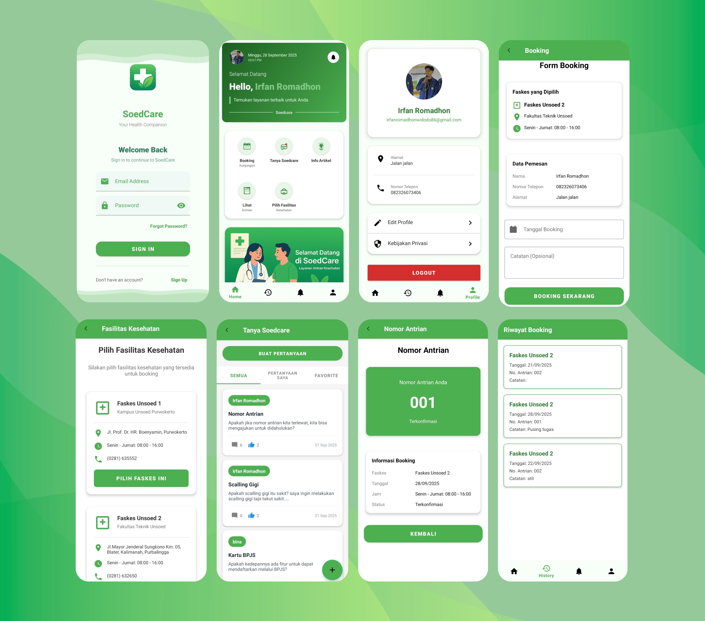

# SOEDCARE



## Latar Belakang
Aplikasi layanan publik pemerintah sering kali memiliki tampilan yang kompleks, fitur yang terlalu banyak, serta alur yang tidak ramah bagi masyarakat umum. Hal ini membuat pengguna kesulitan dalam mengakses layanan yang sebenarnya esensial.  
**SOEDCARE** hadir sebagai solusi dengan pendekatan _user-friendly_ dan terstruktur, memecah kompleksitas menjadi alur yang lebih sederhana, intuitif, serta mudah digunakan.

Dengan SOEDCARE, diharapkan akses masyarakat terhadap layanan publik dapat lebih cepat, jelas, dan efisien.

---

## Tujuan Perancangan Sistem
- Menyediakan aplikasi layanan publik yang sederhana namun efektif.  
- Mempermudah pengguna dalam memahami alur layanan tanpa harus menghadapi kerumitan sistem besar.  
- Menghadirkan pengalaman penggunaan yang modern, responsif, dan konsisten di berbagai perangkat.  
- Membantu masyarakat mendapatkan notifikasi dan informasi terkini terkait layanan publik.

---

## Fitur Utama
- **Pendaftaran Antrian**  
  Memudahkan masyarakat untuk mendaftar layanan kesehatan secara online tanpa harus datang langsung dan menunggu lama.  
- **Forum Kesehatan**  
  Wadah interaktif bagi pengguna untuk berdiskusi, berbagi pengalaman, serta mendapatkan informasi kesehatan dari komunitas maupun tenaga medis.  
- **Autentikasi & Manajemen Akun**  
  Registrasi, login, serta keamanan berbasis standar modern.  
- **Dashboard Informasi**  
  Menampilkan informasi penting dengan visualisasi yang jelas.  
- **Notifikasi Real-time**  
  Memberikan informasi terbaru kepada pengguna secara langsung.  
- **UI/UX Sederhana**  
  Fokus pada kemudahan navigasi dan pengalaman pengguna.  

---

## Petunjuk Penggunaan
1. **Clone Repositori**
   ```bash
   git clone https://github.com/IrfanRomadhonWidodo/SoedCare.git
   cd SoedCare
2. **Buka Project & Update SDK**
    - Jalankan **Android Studio**.  
    - Pilih **Open Project** dan arahkan ke folder `SoedCare`.  
    - Setelah project terbuka, buka file `app/build.gradle`.  
    - Ubah konfigurasi SDK menjadi:
  ```gradle
android {
    namespace = "com.fanalbin.soedcare"
    compileSdk = 36

    defaultConfig {
        applicationId = "com.fanalbin.soedcare"
        minSdk = 28
        targetSdk = 36
        versionCode = 1
        versionName = "1.0"

        testInstrumentationRunner = "androidx.test.runner.AndroidJUnitRunner"
    }

    // ... (konfigurasi lain)
}
```
---

## Demo Aplikasi


