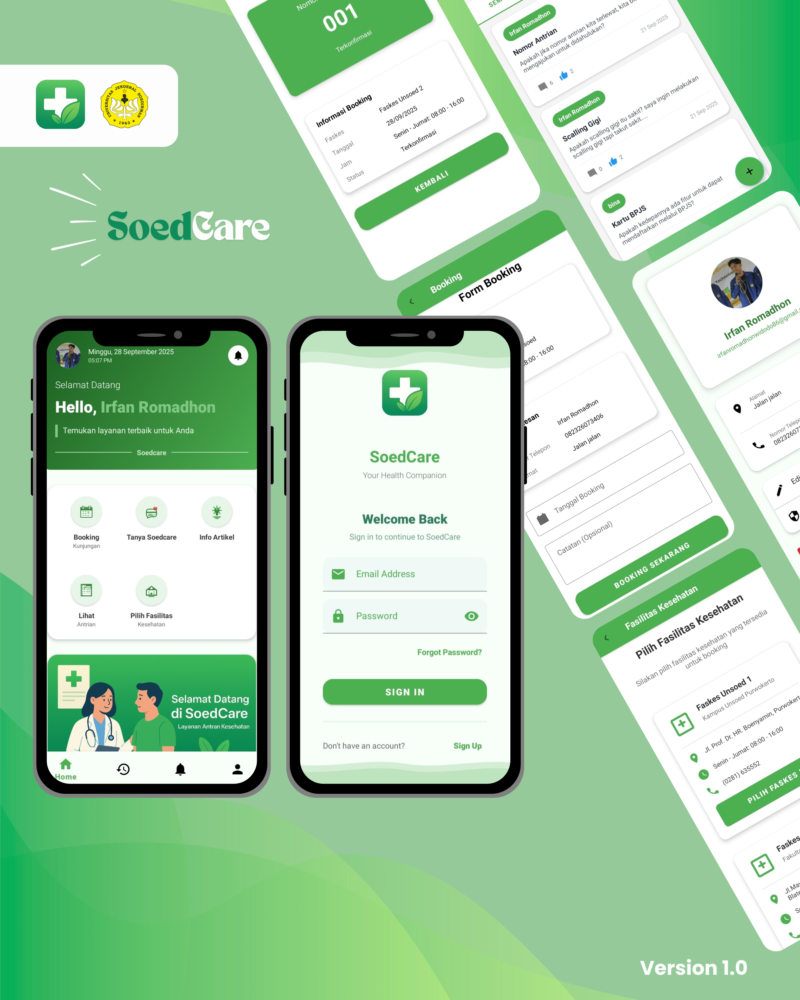

# SOEDCARE


## Latar Belakang
Aplikasi layanan publik pemerintah sering kali memiliki tampilan yang kompleks, fitur yang terlalu banyak, serta alur yang tidak ramah bagi masyarakat umum. Hal ini membuat pengguna kesulitan dalam mengakses layanan yang sebenarnya esensial.  
**SOEDCARE** hadir sebagai solusi dengan pendekatan _user-friendly_ dan terstruktur, memecah kompleksitas menjadi alur yang lebih sederhana, intuitif, serta mudah digunakan.

Dengan SOEDCARE, diharapkan akses masyarakat terhadap layanan publik dapat lebih cepat, jelas, dan efisien.

---

## Tujuan Perancangan Sistem
- Menyediakan aplikasi layanan publik yang sederhana namun efektif.  
- Mempermudah pengguna dalam memahami alur layanan tanpa harus menghadapi kerumitan sistem besar.  
- Menghadirkan pengalaman penggunaan yang modern, responsif, dan konsisten di berbagai perangkat.  
- Membantu masyarakat mendapatkan notifikasi dan informasi terkini terkait layanan publik.

---

## Fitur Utama
- **Autentikasi & Manajemen Akun**  
  Registrasi, login, serta keamanan berbasis standar modern.
- **Dashboard Informasi**  
  Menampilkan informasi penting dengan visualisasi yang jelas.
- **Notifikasi Real-time**  
  Memberikan informasi terbaru kepada pengguna secara langsung.
- **Manajemen Data**  
  Menyediakan akses terhadap data dan layanan terkait secara terstruktur.
- **UI/UX Sederhana**  
  Fokus pada kemudahan navigasi dan pengalaman pengguna.

---

## Petunjuk Penggunaan
1. **Clone Repositori**
   ```bash
   git clone https://github.com/IrfanRomadhonWidodo/SoedCare.git
   cd SoedCare
